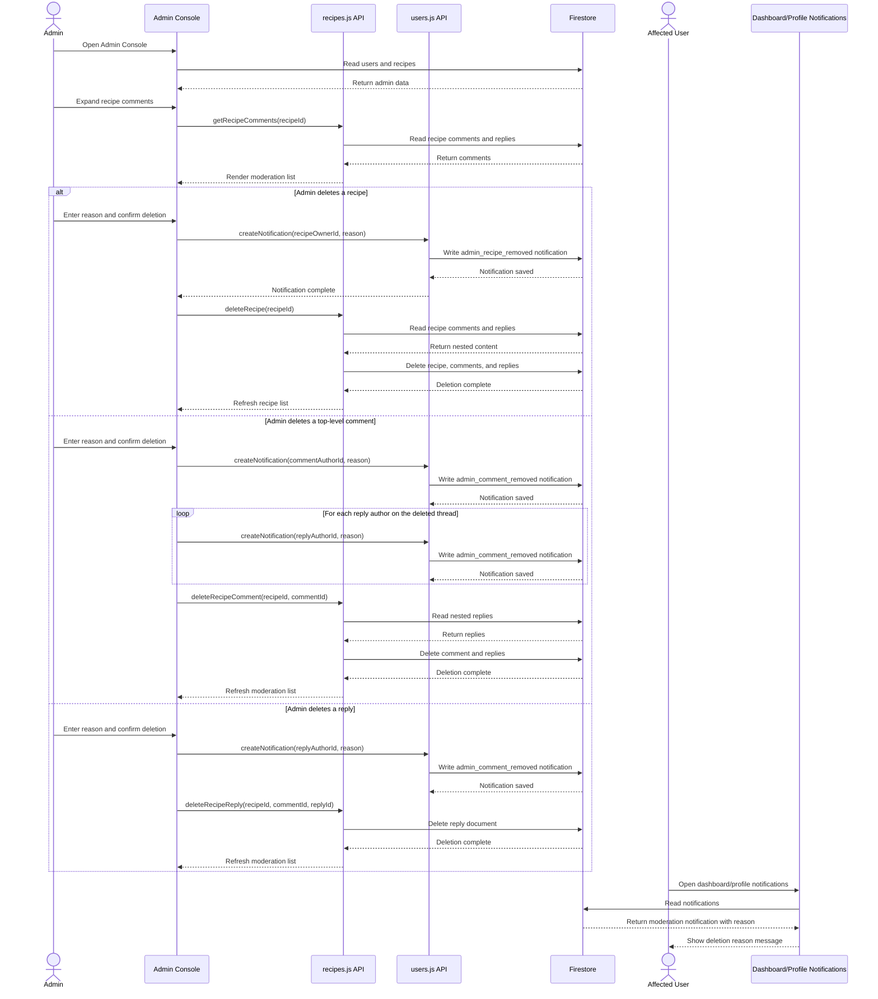

# Admin Moderation Sequence Diagram

```mermaid
sequenceDiagram
    actor Admin
    participant AdminUI as Admin Console
    participant RecipesAPI as recipes.js API
    participant UsersAPI as users.js API
    participant Firestore as Firestore
    actor User as Affected User
    participant Dashboard as Dashboard/Profile Notifications

    Admin->>AdminUI: Open Admin Console
    AdminUI->>Firestore: Read users and recipes
    Firestore-->>AdminUI: Return admin data

    Admin->>AdminUI: Expand recipe comments
    AdminUI->>RecipesAPI: getRecipeComments(recipeId)
    RecipesAPI->>Firestore: Read recipe comments and replies
    Firestore-->>RecipesAPI: Return comments
    RecipesAPI-->>AdminUI: Render moderation list

    alt Admin deletes a recipe
        Admin->>AdminUI: Enter reason and confirm deletion
        AdminUI->>UsersAPI: createNotification(recipeOwnerId, reason)
        UsersAPI->>Firestore: Write admin_recipe_removed notification
        Firestore-->>UsersAPI: Notification saved
        UsersAPI-->>AdminUI: Notification complete

        AdminUI->>RecipesAPI: deleteRecipe(recipeId)
        RecipesAPI->>Firestore: Read recipe comments and replies
        Firestore-->>RecipesAPI: Return nested content
        RecipesAPI->>Firestore: Delete recipe, comments, and replies
        Firestore-->>RecipesAPI: Deletion complete
        RecipesAPI-->>AdminUI: Refresh recipe list
    else Admin deletes a top-level comment
        Admin->>AdminUI: Enter reason and confirm deletion
        AdminUI->>UsersAPI: createNotification(commentAuthorId, reason)
        UsersAPI->>Firestore: Write admin_comment_removed notification
        Firestore-->>UsersAPI: Notification saved

        loop For each reply author on the deleted thread
            AdminUI->>UsersAPI: createNotification(replyAuthorId, reason)
            UsersAPI->>Firestore: Write admin_comment_removed notification
            Firestore-->>UsersAPI: Notification saved
        end

        AdminUI->>RecipesAPI: deleteRecipeComment(recipeId, commentId)
        RecipesAPI->>Firestore: Read nested replies
        Firestore-->>RecipesAPI: Return replies
        RecipesAPI->>Firestore: Delete comment and replies
        Firestore-->>RecipesAPI: Deletion complete
        RecipesAPI-->>AdminUI: Refresh moderation list
    else Admin deletes a reply
        Admin->>AdminUI: Enter reason and confirm deletion
        AdminUI->>UsersAPI: createNotification(replyAuthorId, reason)
        UsersAPI->>Firestore: Write admin_comment_removed notification
        Firestore-->>UsersAPI: Notification saved

        AdminUI->>RecipesAPI: deleteRecipeReply(recipeId, commentId, replyId)
        RecipesAPI->>Firestore: Delete reply document
        Firestore-->>RecipesAPI: Deletion complete
        RecipesAPI-->>AdminUI: Refresh moderation list
    end

    User->>Dashboard: Open dashboard/profile notifications
    Dashboard->>Firestore: Read notifications
    Firestore-->>Dashboard: Return moderation notification with reason
    Dashboard-->>User: Show deletion reason message
```
